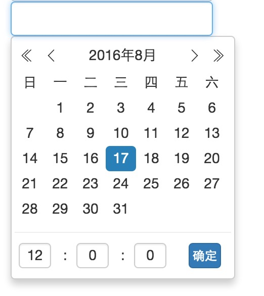
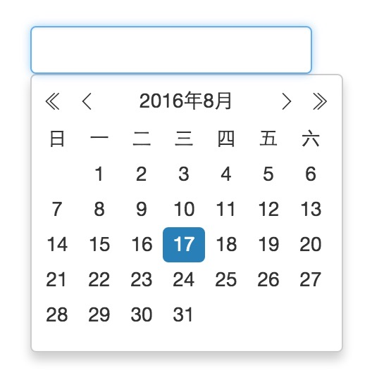

# vue components - datepicker

## start
``` bash
# install dependencies
npm install

# serve with hot reload at localhost:8080
npm run dev

# build for production with minification
npm run build
```
## feature
 1. 支持两种类型的时间选择- 日期选择 & 日期时间选择
 
## requirement:
 1. vue.js
 2. date-fns (时间库)
## usage

```javascript
// 只选择日期
<date-picker :val.sync="curDate" type="date"></date-picker>

// 可以选择日期和时间
<date-picker :val.sync="curDate" type="date-time"></date-picker>
```

## API

|  选项   |   类型    | 默认值    | 说明 |
| :----   |  :----   | :----    | :----|
|   val   |   String  | ' ' (空)  | 同步更新组件父子组件间时间的值|
| type    | String    |  'date'   | 'date' => 输出YYYY-MM-DD格式的日期时间  <br>   'date-time' => 输出YYYY-MM-DD HH:mm:ss的日期时间|

## 如何引入到你的项目中
  1. 复制date-picker文件(src/components目录下)到你的components组件文件下
  2. 引入组件,并声明,也可以全局注册组件

## 使用例子
```javascript
<!-- App.vue -->
<template>
  <div id="app">
    <form @submit.prevent="">
      <div class="form-group">
        <date-picker :val.sync="curDate" type="date"></date-picker>
        <date-picker :val.sync="curDate" type="date-time"></date-picker>
      </div>
    </form>

  </div>
</template>
<script>
  import DatePicker from './components/date-picker/date-picker.vue'

  export default {
    components: {
      'date-picker': DatePicker
    },
    data () {
      return {
        curDate: ''
      }
    }
  }
</script>

<style lang="less">
  * {
    margin: 0;
    padding: 0;
  }
  #app {
    margin: 100px;
    width: 300px;
  }
</style>

```
## 备注:

 1. 样式基于less

## 截图



